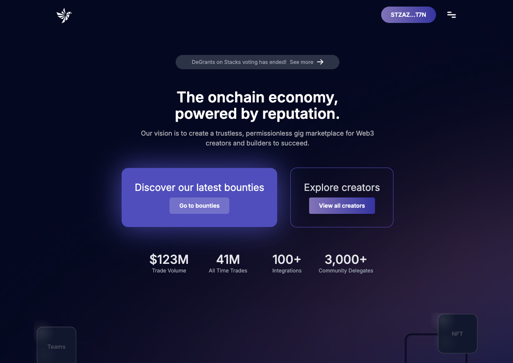
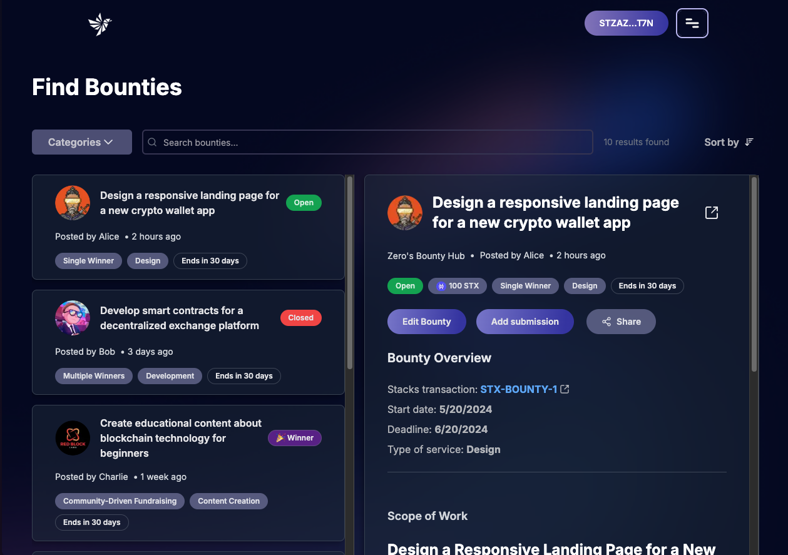
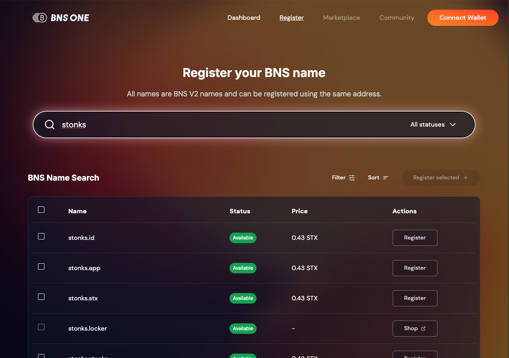
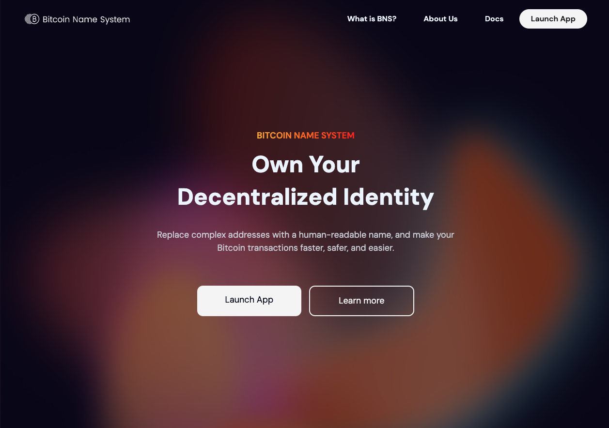
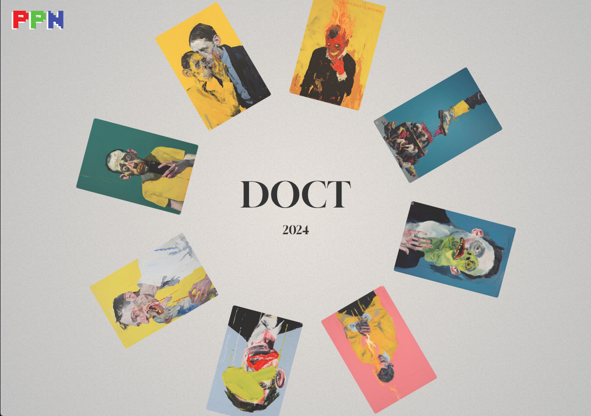

# Red Block Labs - Stacks Bitcoin L2 Portfolio

Red Block Labs specializes in frontend development and UX design for Stacks blockchain projects. We create high-quality, user-friendly decentralized applications. We collaborated with projects in the Stacks Ecosystem.
Our portfolio demonstrates our expertise in helping Stacks ecosystem projects succeed through effective frontend development and strategic design solutions.

## Zero Authority - Decentralized Freelance Platform

Zero Authority is a decentralized freelance platform connecting talent with opportunities through smart contracts. Our team led the complete frontend redesign and development for their V2 launch.

Red Block Labs designed and developed Zero Authority's frontend:

### Results:

- Designed and developed 25+ pages including:
  - Landing page and user onboarding flows
  - Project creation and bidding interfaces
  - Freelancer profiles and portfolio showcase
  - Analytics dashboards
  - Escrow management system
  - Wallet integration and transaction flows
  - Project management workspace
  - Review and rating interfaces
- Created modern, responsive UI with seamless wallet connectivity
- Built real-time analytics dashboard for platform metrics
- Implemented automated escrow management interface
- Delivered complete frontend platform ready for V2 launch

## BNS One | Bitcoin Name System

**[Live Site](https://bns.one)**

BNS One is a modern interface for managing .btc domains on the Bitcoin Name System. The platform provides an intuitive way to search, register, trade and manage Bitcoin domain names through a seamless user experience.

**Red Block Labs** designed and developed [bns.one](https://bns.one)'s frontend:

### Results

- Created modern, intuitive user interface for .btc domain management
- Designed and developed frontend features including:
  - Domain search and registration flow
  - Trading marketplace interface
  - Transact / Order Summary page
  - Domain management dashboard
- Focused on user experience through:
  - Clean, minimalist design
  - Simple registration process
  - Clear transaction status updates
  - Mobile-friendly interface
- Implemented secure wallet connections for domain operations
- Delivered complete frontend platform at [bns.one](https://bns.one)

## BNS Foundation | Community Platform

**[Live Site](https://bns.foundation)**

BNS Foundation is a community-driven platform for the Bitcoin Name System ecosystem. We designed and built a modern, engaging landing page that showcases the foundation's mission and activities while providing an intuitive interface for community interaction.

**Red Block Labs** designed and developed [bns.foundation](https://bns.foundation)'s frontend:

### Results

- Created modern, dark-themed community landing page with:
  - Animated gradient backgrounds
  - Interactive UI elements
  - Dynamic illustrations
  - Modern hero section
  - Intuitive site navigation
- Optimized for performance and accessibility
- Delivered professional interface appealing to:
  - Crypto-native users
  - Newcomers to the ecosystem
- Established strong brand presence through cohesive design
- Successfully launched complete frontend at [bns.foundation](https://bns.foundation)

## DocT | Art Drop Landing Page

**[Live Site](https://doct-vite.vercel.app)**

[DocT](https://x.com/DocT___) is a pediatrician and artist whose groundbreaking "They Are Here" collection explores themes of human endurance and memory through neo-expressionist works. The collection was featured at the White Night of the Galleries [CryptoArt V4.0] in Craiova, Romania and includes the historic first human brain inscription on Bitcoin.

**Red Block Labs** designed and developed [the collection](https://doct-vite.vercel.app)'s landing page:

### Results

- Created immersive art showcase platform using:
  - Dynamic gallery interface with smooth transitions
  - Interactive artwork viewing experience
  - Mobile-responsive design
  - Minimalist navigation
- Optimized user experience through:
  - Clean, focused layout highlighting the artwork
  - Smooth animations and transitions
  - Intuitive gallery navigation
  - High-performance image loading
- Successfully launched at [doct-vite.vercel.app](https://doct-vite.vercel.app)

### Contact us at [info@redblocklabs.xyz](mailto:info@redblocklabs.xyz)
